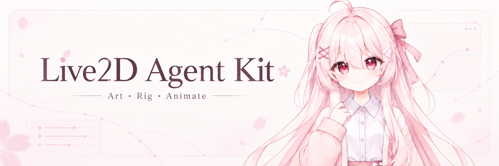
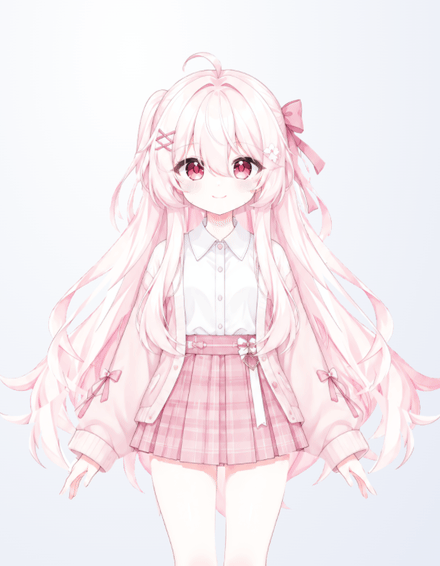
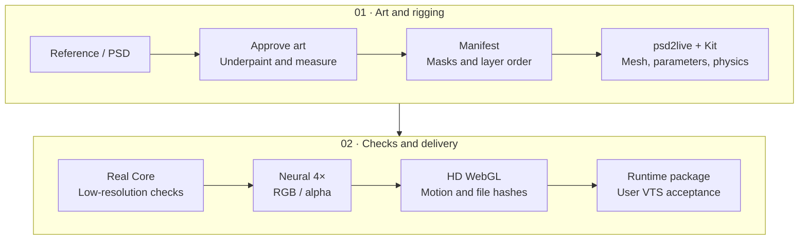

<div align="center">



# Live2D Agent Kit

A workflow for building Live2D models from reference art with Codex or another coding agent.

**English** · [简体中文](README.md)

[](THIRD_PARTY_NOTICES.md)
[](examples/pink-sakura/LICENSE.md)
[](docs/case-study.md)
[](docs/verification.md)

[Quick start](#quick-start) · [Pink Sakura example](examples/pink-sakura/README.md) · [Tool catalog](tools/README.md) · [Workflow](docs/workflow.md) · [Agent skill](SKILL.md)

This project is not affiliated with Live2D Inc.

<sub>Header illustration: <a href="assets/readme/README.md">source and CC BY 4.0 credit</a>.</sub>

</div>

This kit contains the source recipes, export scripts and checks used to build a Live2D character with an agent. Start with your own reference image or layered PSD, preserve the approved face, reconstruct hidden areas, rig the layers and export a real `.moc3`. The kit includes a model preview that runs Cubism Core in WebGL and accepts simulated face and upper-body tracking inputs.

The character work and repair process documented here used **GPT-6 Astra Ultra** in Codex. Other agents can follow the same files and commands; GPT-6 Astra Ultra is the configuration recorded for this case. A flat illustration still needs decisions about hidden eyelids, the mouth interior, hair and clothing; those decisions should preserve the artwork the owner approved.

Start with the geometric minimal example to check your local export chain before spending time on character art. The [reproducibility guide](docs/reproducibility.md) separates published inputs, rebuildable working outputs and external dependencies.

## Pink Sakura example

[Pink Sakura](examples/pink-sakura/README.md) includes the source art, character-specific layer measurements, build recipe, HD runtime model and verification records. These images are captures of the exported model in the browser. The GIF uses simulated inputs and does not access a camera.

| Neutral face | Closed eyes | Open smile | Motion preview |
| :---: | :---: | :---: | :---: |
|  |  |  |  |

[Runtime files](examples/pink-sakura/runtime/) · [Rebuild the example](examples/pink-sakura/README.md#复现模板) · [Original reference](examples/pink-sakura/source/reference.png) · [Verification records](examples/pink-sakura/verification/README.md)

The canvas captures have transparent backgrounds, so their surroundings can appear light or dark depending on the README viewer's theme. The header is a separate illustration; the table contains runtime captures.

| What was checked | Recorded result |
| --- | --- |
| Model structure | 24 source layers, 26 drawables, 24 parameters, 7,180 vertices and 11,904 triangles |
| Rig controls | Independent eyebrows, eyes, mouth, head, body, breathing and 8 hair-swing parameters; all 24 parameters produced a measured drawable change |
| Neural upscaling | One 2048² atlas became 8192² with `realesr-animevideov3-x4`; RGB and alpha were processed separately |
| Native Cubism Core | 202 sampled poses passed, including 125 mouth form/open combinations |
| Browser checks | 22 checks passed; 66 poses produced 91 canvas captures, with loaded MOC and texture hashes verified |
| Visual review | Agents inspected 44 face crops at source resolution and 31 reduced full-body overviews; scope and limitations are recorded |
| Motion recording | 72 frames at 12 fps, captured from the actual WebGL canvas |
| VTube Studio | Acceptance remains with the user; it has not been completed for this example |

The visual review passed with minor limitations. Fine closed-mouth lines can look pale or grainy under magnification, closed-lash tips remain slightly blunt with edge steps, and `EyeOpen` from 0 to 0.25 holds the closed pose. The rig uses conservative 2D head/body movement and a combined body layer. It has no independent arm or finger rig. Optional local camera tracking is described below. See the [visual report](examples/pink-sakura/verification/visual-review.json) for the sampled scope.

The original reference carries the owner's source statement: **"此图片来自 ChatGPT Image2.5 生成"** ("This image was generated with ChatGPT Image2.5"). The project has not independently verified that service version. Generated underpainting and rig construction have separate credits in [ATTRIBUTION.md](examples/pink-sakura/ATTRIBUTION.md) and [source-provenance.json](examples/pink-sakura/source-provenance.json).

## What the kit contains

| Your starting point | Included approach | Output |
| --- | --- | --- |
| Reference art or a front-view illustration | Approved master image, hidden-area underpainting, measured masks and five coordinate spaces | Rebuildable assets and a manifest |
| Layered PSD or PNG layers | Import adapters, a pinned psd2live revision and cumulative patches | PSD, CMO3, MOC3, texture atlas, parameters and physics |
| A model with visible seams | Diagnostics for mouth skin patches, eyelid breaks, dark borders and hair/strap misalignment | A repair tied to the source layer, rig or texture sampling |
| Correct geometry with blurry textures | Local NCNN anime upscaling with separate alpha and source hashes | An HD runtime atlas with matching geometry and UVs |
| Face and upper-body input | WebGL rendering, simulation, optional local camera inference, calibration and parameter controls | A browser preview for face, eyebrow and approximate shoulder/torso tracking |
| A model ready to package | Resource validation, native Core checks and browser tests | A runtime folder, ZIP and verification evidence |

CMO3 and PSD are editing outputs; `.moc3`, textures and referenced JSON files form the runtime. Keep the exporter warnings: Pink Sakura's CMO3 reconstructs editable layers from the atlas and retains model/rig data, but does not preserve the original PSD source-image editing chain. Its published source images and recipe are therefore part of the rebuild workflow.

## Production sequence



Fix the layer structure before upscaling. A hair cutout that includes part of a suspender will move those clothing pixels with the hair. Neural upscaling makes that break easier to see; the source mask and the clothing underneath need the repair. The [workflow](docs/workflow.md) describes each stage, its outputs and how to resume after an interruption.

## Quick start

Install Git, Python 3.10+ and JDK 21. Use Node.js 22+ for the character recipe, browser tools and module tests. Follow [setup.md](docs/setup.md), then run commands from the repository root. Generated outputs belong in the ignored `work/` directory; use a new output directory for each run.

### 1. Export the geometric example

```sh
bash scripts/doctor.sh
bash scripts/setup-psd2live.sh
java --source 21 examples/minimal-model/GenerateExample.java work/minimal/assets
bash scripts/export-model.sh work/minimal/assets/manifest.json work/minimal/low
bash scripts/validate.sh --model work/minimal/low/Minimal.model3.json
```

The generator creates 16 original geometric layers. The exporter writes PSD, CMO3, MOC3 and a 1024² atlas. The last command checks file structure; native Core validation is a separate step.

### 2. Give your agent the artwork and task

```text
Read SKILL.md, tools/README.md and docs/workflow.md, then build a Live2D model from my artwork.
Check the available tools and run the minimal example first.
Establish the approved master image, measure layer positions, reconstruct hidden areas and build the rig.
Preserve the face and art style I approve. Repair source masks and seams before anime upscaling.
Deliver rebuildable source materials, a self-contained runtime package, an actual model preview and verification records for those files.
Report native Core, browser and VTube Studio acceptance separately.
```

[prompts/astra.md](prompts/astra.md) has a longer prompt for sustained model work. An agent can read [SKILL.md](SKILL.md) directly or use it through its host's skill installation mechanism.

<details>
<summary>3. Validate with official Core and package the runtime</summary>

Obtain the Java/native Core appropriate for your machine from your existing installation or the official distribution, then follow the [Core setup guide](docs/setup.md#配置本机官方-core).

```sh
export CUBISM_CORE_DIR=/path/to/your/local/core
bash scripts/validate_core.sh work/minimal/low/Minimal.moc3 work/minimal/core-report.json
bash scripts/validate.sh --model work/minimal/low/Minimal.model3.json \
  --core-report work/minimal/core-report.json
python3 scripts/package-model.py --model work/minimal/low/Minimal.model3.json \
  --core-report work/minimal/core-report.json --output work/minimal/runtime
```

The package includes a runtime folder and ZIP whose relative resource paths work away from the author's computer. The native report identifies the tested MOC by SHA-256. Visual review and acceptance in the target application remain separate checks. For attributed assets, the packager can also include license and credit files; the Pink Sakura recipe shows the relevant flags.

</details>

<details>
<summary>4. Upscale the atlas and prepare the browser preview</summary>

Use a local Upscayl CLI and a model directory containing the matching files `realesr-animevideov3-x4.param` and `realesr-animevideov3-x4.bin`. Get them through [Upscayl](https://github.com/upscayl/upscayl), [custom-models](https://github.com/upscayl/custom-models) and the [upscaling guide](docs/upscaling.md). Weights are not bundled with this repository. A PyTorch `.pth` file is not an NCNN model pair.

```sh
bash scripts/upscale-atlas.sh \
  --manifest work/minimal/assets/manifest.json \
  --export work/minimal/low --output work/minimal/upscale \
  --binary /path/to/upscayl-bin --models /path/to/models \
  --model realesr-animevideov3-x4
bash scripts/export-model.sh work/minimal/upscale/manifest-hd.json work/minimal/hd
```

The minimal example's 1024² atlas becomes 4096². Pink Sakura uses the same method for 2048² to 8192²: NCNN processes RGB with the neural model, while bicubic scaling handles the cleaned alpha independently. Atlas layout, normalized UVs and geometry stay fixed; low-resolution and HD MOC files were byte-identical in the recorded runs. This improves the runtime atlas, not the resolution of every editable PSD layer.

`realesr-animevideov3-x4` was selected after comparing it with `4x-AnimeSharp-fp32` on the original character's face samples. AnimeVideo better preserved that character's softer appearance; this is a documented choice for those samples, not a general ranking. The [upscaling guide](docs/upscaling.md) records weight hashes, tile size, CLI flags and texture-size limits.

Prepare the preview with your local Web Core and rendering dependencies:

```sh
python3 scripts/prepare-preview.py \
  --model work/minimal/hd/Minimal.model3.json --output work/minimal/preview \
  --cubism-core /path/to/live2dcubismcore.min.js --vendor-dir /path/to/vendor
python3 work/minimal/preview/server.py --port 8793
```

Choose an unused port if 8793 is occupied. The preview provides simulated face and upper-body inputs. The [preview guide](templates/web-preview/README.md) covers dependency filenames, framing, parameter mapping and browser checks with Playwright.

</details>

## Tools and upstream projects

The [tool catalog](tools/README.md) distinguishes production use, supporting validation, evaluation only and kit development. Each entry records its purpose, evidence, known version, upstream source, acquisition method and license scope. The repository contains our adapters, patches and scripts; obtain third-party applications, SDKs and model weights from their own distributors.

[Machine-readable catalog](tools/catalog.json) · [Command reference](tools/commands.md) · [Host capability mapping](tools/host-capabilities.md)

| Area | Tools and original sources | Guide |
| --- | --- | --- |
| Export engine | [psd2live](https://github.com/tsunehimatoi/psd2live), [agent architecture](https://github.com/tsunehimatoi/psd2live/blob/master/docs/zh/AGENT_ARCHITECTURE.md) | [Setup](docs/setup.md), [adapter](integrations/psd2live/README.md), [patches](patches/README.md) |
| Official baseline | [Live2D Simple Model](https://www.live2d.com/en/learn/sample/simple-model/), [Cubism SDK](https://www.live2d.com/en/sdk/download/), [Web SDK](https://www.live2d.com/en/sdk/download/web/) | [Environment checks](docs/tooling.md), [Core setup](docs/setup.md#配置本机官方-core) |
| Anime upscaling | [Upscayl](https://github.com/upscayl/upscayl), [custom-models](https://github.com/upscayl/custom-models), [upscayl-ncnn](https://github.com/upscayl/upscayl-ncnn), [Real-ESRGAN](https://github.com/xinntao/Real-ESRGAN) | [Models, alpha and UV handling](docs/upscaling.md) |
| Browser rendering and checks | [PixiJS](https://github.com/pixijs/pixijs), [pixi-live2d-display](https://github.com/guansss/pixi-live2d-display), [Playwright](https://github.com/microsoft/playwright) | [Preview template](templates/web-preview/README.md), [verification](docs/verification.md) |
| Camera input | [MediaPipe Tasks Vision](https://github.com/google-ai-edge/mediapipe), Face / Pose Landmarker | [Setup and physical-device checks](docs/camera-tracking.md), [dependency lock](tools/tracking-dependencies.json) |
| Skill and MCP | [Kit skill](SKILL.md), [CLI-Anything Live2D](https://github.com/HKUDS/CLI-Anything/blob/main/live2d/agent-harness/cli_anything/live2d/skills/SKILL.md), [CubismExternalEditMCP](https://github.com/nana7chi/CubismExternalEditMCP) | [Capabilities and limits](mcp/README.md), [host mapping](tools/host-capabilities.md) |
| Builds and image diagnostics | Java, Gradle, Kotlin, Python, Pillow, NumPy, psd-tools, ImageMagick, FFmpeg, Node.js, Git, SHA-256 and ZIP | [Sources and usage records](tools/README.md), [commands](tools/commands.md) |
| Documentation editing | Humanizer and Humanizer-zh | [Tool sources and writing-only scope](tools/README.md) |

The official sample helps isolate loading and environment problems. File validation, SDK mesh evaluation, rendered-image review and VTube Studio acceptance answer different questions; the records identify which ones ran.

## Local camera face and upper-body tracking

The optional camera input drives eyebrows, eyes, gaze, mouth and head angles, with approximate torso/shoulder angles from a single camera. Each target needs a visible model binding. Simulation and manual parameter controls remain available.

```sh
python3 scripts/setup-tracking.py --directory .cache/mediapipe
python3 scripts/prepare-preview.py \
  --model examples/pink-sakura/runtime/PinkSakura.model3.json \
  --output work/pink-camera-preview \
  --cubism-core /path/to/live2dcubismcore.min.js --vendor-dir /path/to/vendor \
  --config examples/pink-sakura/preview-config.json \
  --tracking-dir .cache/mediapipe
python3 work/pink-camera-preview/server.py --port 8860
```

Start the camera explicitly, grant browser access, then face forward and calibrate. Inference runs locally, with no video upload, recording or microphone request. Switching to simulation or manual controls releases the camera. Tracking dependencies are acquired separately from pinned URLs and hashes. The preview server’s same-origin connection policy blocks the SDK’s default usage-statistics requests; preserve this policy if hosting the page elsewhere. There is no independent arm or finger rig. See the [camera guide](docs/camera-tracking.md) for setup and measured test scope, and the [changelog](CHANGELOG.md) for this update. All [16 physical-camera checks](docs/verification/camera-tracking.json) passed on the final eyebrow-bound model; shoulder tracking was observed, while hip-dependent torso pitch accuracy was not verified.

## Verification and rebuilding

The published geometric example records are local runs from **2026-09-12**. They are separate from Pink Sakura and are not an online CI result or a quality guarantee for arbitrary characters.

| Geometric example | Recorded result |
| --- | --- |
| Export | 16 layers produced real MOC3 and CMO3 files |
| Native Core | Core 6.0.257 evaluated 192 sampled poses, including 125 mouth/head/body/eye combinations |
| Atlas | NCNN neural RGB 4× with separate alpha, 1024² to 4096²; low and HD MOC files were byte-identical |
| Browser | 22 checks passed using Web Core 5.1.0 and actual WebGL rendering; loaded MOC/PNG hashes matched the manifest |

The current minimal example has two separate eyebrow layers; all 19 parameters produced a measured drawable change. The [verification guide](docs/verification.md) separates this result from the earlier empty eyebrow slots, and includes file hashes and negative tests. The [case study](docs/case-study.md) covers the earlier character and its repairs.

The current recipes contain 24 Pink Sakura layers and 16 geometric layers, with deterministic eyebrow source generation included. A full engine build from an initially empty cache compiled the source and exported the minimal model, which passed native Core and 22 real WebGL checks. The public Pink recipe also exported from that newly compiled engine, passed Core and produced a MOC identical to the HD release. This run used a source-only checkout and an optional local curl download relay; download retries are recorded separately from the successful compile. The [reproducibility guide](docs/reproducibility.md) records what can be rebuilt, what must be downloaded and which build checks have run. The [repository review](docs/repository-review.md) covers the bilingual docs and asset-input fixes.

`work/` contains generated manifests, exports, upscaled atlases, previews and test outputs. Those files belong to a local run; published source recipes and recorded dependency identities are the inputs for rebuilding them. Official SDK/Core binaries and upscaling weights remain external dependencies.

To check the kit without an SDK or network access:

```sh
python3 -m unittest discover -s tests -v
bash scripts/validate.sh --kit
```

## Guides by task

| Task | Read |
| --- | --- |
| Install tools and check Core | [Setup](docs/setup.md), [tool catalog](tools/README.md) |
| Begin a character or resume a long task | [Workflow](docs/workflow.md), [Astra prompt](prompts/astra.md) |
| Measure crops, masks and layer order | [Manifest and five coordinate spaces](docs/manifest.md) |
| Repair eyelids, skin seams, suspenders or hair | [Troubleshooting](docs/troubleshooting.md), [case study](docs/case-study.md) |
| Select an upscaling model and preserve transparent edges | [Anime upscaling](docs/upscaling.md) |
| Drive parameters and inspect real model rendering | [Web preview](templates/web-preview/README.md) |
| Decide whether a skill or MCP fits the task | [MCP guide](mcp/README.md), [host capability mapping](tools/host-capabilities.md) |
| Rebuild, validate and package | [Reproducibility](docs/reproducibility.md), [commands](tools/commands.md), [verification](docs/verification.md) |

<details>
<summary>Repository layout</summary>

```text
live2d-agent-kit/
├── README.md / README.en.md  Chinese and English entry points
├── SKILL.md                 Agent workflow instructions
├── LICENSE                  MIT license for original code and documents
├── THIRD_PARTY_NOTICES.md    Attribution and third-party license scope
├── assets/readme/           README artwork
├── tools/                   Catalog, JSON records, host mapping and commands
├── docs/                    Setup, workflow, layer recipes, upscaling and repairs
├── prompts/                 Prompts for sustained agent work
├── mcp/                     Optional MCP and skill integration notes
├── integrations/psd2live/    Manifest/PSD adapters and engine lock
├── patches/                 Cumulative psd2live patch
├── scripts/                 Export, upscale, Core, preview and packaging tools
├── templates/web-preview/   Reusable preview for actual Live2D models
├── examples/minimal-model/  Original geometric asset generator
├── examples/pink-sakura/    Character art, recipe, HD runtime and evidence
├── tests/                   Checks that do not require an SDK
├── third_party/             GPL text for the patch and integration
└── work/                    Ignored, rebuildable local outputs
```

</details>

## Attribution and model reuse

Pink Sakura's named art and model assets use [CC BY 4.0](examples/pink-sakura/LICENSE.md). You may use, share and modify them, including commercially, with attribution and a description of your changes. Credit your own work while preserving the original source credits; do not present yourself as the original creator. The recipe code remains MIT.

Public runtime files can be copied, including files a browser downloads to render the model. Attribution files, provenance records and optional watermarks help identify sources; they do not prevent extraction. The [model protection guide](docs/model-protection.md) explains visible and invisible watermark options, their tests and their limits. The example has no project-applied visible or invisible watermark. Its generated source PNGs retain embedded `caBX` blocks whose claims and signatures were not independently verified.

## Licenses

Original independent code, documentation and prompts use [MIT](LICENSE). The cumulative `patches/psd2live-agent-kit.patch` and `integrations/psd2live/*.kt` use **GPL-3.0-only**. [THIRD_PARTY_NOTICES.md](THIRD_PARTY_NOTICES.md) defines those scopes.

Pink Sakura's authorized art and runtime assets are separately covered by [CC BY 4.0](examples/pink-sakura/LICENSE.md). The [README header illustration](assets/readme/README.md) also has its own CC BY 4.0 credit. User artwork, official samples, Live2D SDK/Framework files, third-party applications and upscaling weights retain their respective terms. The code license does not relicense those materials.

The [tool catalog](tools/README.md) credits psd2live, Live2D, Upscayl, Real-ESRGAN, PixiJS, pixi-live2d-display, Playwright and the optional skill/MCP projects, with sources and usage records for each.

**This project is not affiliated with Live2D Inc.**
