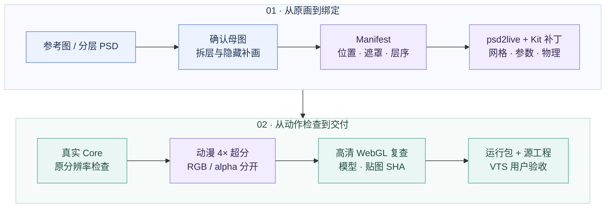

<div align="center">

# Live2D Agent Kit

### 从参考图到 Live2D，把制作经验变成可复用的工作流。

**保留原画 · 精确拆层 · 真实绑定 · 动漫超分 · 动作验证**

[](docs/workflow.md)
[](docs/case-study.md)
[](THIRD_PARTY_NOTICES.md)
[](docs/verification.md)

[快速开始](#快速开始) · [工具参考库](tools/README.md) · [完整流程](docs/workflow.md) · [排错经验](docs/troubleshooting.md) · [Agent Skill](SKILL.md)

<sub>This project is not affiliated with Live2D Inc.</sub>

</div>

---

这是给 **Codex 与其他 coding agent** 的 Live2D 制作 kit：从自己的参考图或分层 PSD 出发，
整理绘画、拆层坐标和绑定，导出真正的 `.moc3`，再用官方 Core 与网页动作检查验证。
仓库同时提供可复用代码、工具来源、命令速查与多轮修复经验。

实践使用 **GPT-6 Astra Ultra** 成功完成角色制作与迭代。这是一次实际案例的使用配置，
其他 agent 也可以按流程执行。平面图里被遮挡的眼皮、口腔、后发和衣服需要补画；
已认可的脸部和画风应作为整个流程的基准。

> **第一次使用：** 先跑通原创几何最小示例，确认本机导出链与 Core 可用，再开始角色美术。
> 工具参考库记录实际使用、辅助检查与仅评估项目，获取说明和许可随条目提供。

## 能做什么

| 从哪里开始 | Kit 提供什么 | 你会得到什么 |
| --- | --- | --- |
| **参考图 / 正面立绘** | 母图确认、隐藏补画、五坐标系与精确遮罩工作法 | 可复建的素材与 manifest |
| **分层 PSD / PNG 图层** | 提取适配器、固定版 psd2live 与累计补丁 | PSD、CMO3、MOC3、图集、参数和物理 |
| **已有模型有接缝** | 嘴周色差、闭眼断线、黑边、发丝/背带错位的排查方法 | 定位到素材、绑定或采样的修复记录 |
| **结构正确但纹理模糊** | 本地 NCNN 动漫 4× 超分、独立 alpha、来源 SHA 检查 | 保持几何与 UV 的高清运行图集 |
| **需要预演面捕输入** | 真实 WebGL 模型、参数面板、时间线、暂停与半身合成输入 | 可检查动作与资源身份的预览网页 |
| **准备交付** | 资源验证、原生 Core 检查、浏览器实测与打包脚本 | 自足运行包、证据与明确的验收范围 |

## 一条完整的制作路线




**先修结构，再提清晰度。** 超分能改善纹理采样，发片里混入的衣服像素仍需先从正确的 alpha 轮廓中清理。
完整步骤、每阶段交付和恢复方式见 [workflow.md](docs/workflow.md)。

## 快速开始

需要 **Git、Python 3.10+、JDK 21**；先按 [setup.md](docs/setup.md) 配好 Java。
所有命令从仓库根目录运行，生成物放在忽略的 `work/`，每次实验使用新输出目录。

### 1 · 跑通真实导出

```sh
bash scripts/doctor.sh
bash scripts/setup-psd2live.sh
java --source 21 examples/minimal-model/GenerateExample.java work/minimal/assets
bash scripts/export-model.sh work/minimal/assets/manifest.json work/minimal/low
bash scripts/validate.sh --model work/minimal/low/Minimal.model3.json
```

这里生成 **14 个原创几何图层**，导出真正的 PSD、CMO3、MOC3 和 1024² 图集。
最后一行检查文件结构；原生检查另外配置官方 Core。

### 2 · 交给 agent 制作自己的角色

把自己的图片或 PSD 与下面的提示一起交给 agent：

```text
阅读 SKILL.md、tools/README.md 和 docs/workflow.md，按本仓库流程制作我的 Live2D 模型。
先检查可用工具并跑通最小示例，再确定母图、测量位置、拆层和绑定。
保留我认可的脸和画风；先修素材及接缝，再做专用动漫超分。
交付可复建的源工程、自足运行包、真实模型网页预览和对应文件的验证结果。
分别说明 Core、网页和 VTube Studio 已完成的验收范围。
```

更完整的长任务提示：[prompts/astra.md](prompts/astra.md)。
根目录 [SKILL.md](SKILL.md) 可以直接阅读，也可按宿主的技能安装方式随本仓库一起使用。

<details>
<summary><strong>3 · 官方 Core 验证与运行包打包</strong></summary>

从用户已有的合法安装或官方分发取得适合本机的 Java/native Core，见 [Core 配置](docs/setup.md#配置本机官方-core)。

```sh
export CUBISM_CORE_DIR=/path/to/your/local/core
bash scripts/validate_core.sh work/minimal/low/Minimal.moc3 work/minimal/core-report.json
bash scripts/validate.sh --model work/minimal/low/Minimal.model3.json \
  --core-report work/minimal/core-report.json
python3 scripts/package-model.py --model work/minimal/low/Minimal.model3.json \
  --core-report work/minimal/core-report.json --output work/minimal/runtime
```

打包结果为独立的运行文件夹与 ZIP，资源引用不依赖作者电脑的路径。
原生报告绑定实际 MOC 的 SHA；最终视觉与目标软件验收另行记录。

</details>

<details>
<summary><strong>4 · 专用动漫超分与真实网页预览</strong></summary>

超分使用本机 Upscayl CLI 与模型目录，具体获取和参数见 [upscaling.md](docs/upscaling.md)。

```sh
bash scripts/upscale-atlas.sh \
  --manifest work/minimal/assets/manifest.json \
  --export work/minimal/low --output work/minimal/upscale \
  --binary /path/to/upscayl-bin --models /path/to/models \
  --model realesr-animevideov3-x4
bash scripts/export-model.sh work/minimal/upscale/manifest-hd.json work/minimal/hd
```

最小示例的 1024² 图集变为 4096²，逻辑坐标不变。后续用本地 Web Core 与预览依赖准备页面：

```sh
python3 scripts/prepare-preview.py \
  --model work/minimal/hd/Minimal.model3.json --output work/minimal/preview \
  --cubism-core /path/to/live2dcubismcore.min.js --vendor-dir /path/to/vendor
python3 work/minimal/preview/server.py --port 8793
```

端口被占用时改用空闲端口。网页提供合成面部/半身输入；真实摄像头、手臂和手指追踪不在当前实现范围。
依赖文件名、取景、输入映射与浏览器检查见 [网页模板说明](templates/web-preview/README.md)。

</details>

## 工具参考库

**[查看完整工具目录 →](tools/README.md)** · [机器可读清单](tools/catalog.json) · [命令速查](tools/commands.md) · [宿主能力映射](tools/host-capabilities.md)

参考库现有 **43 项**，分为生产使用、辅助验证、仅评估与 kit 开发。
每项记录用途、使用证据、已知版本、上游来源、获取方式和许可边界。
仓库保留我们编写的适配器、补丁和脚本；第三方应用、权重和 SDK 通过原始来源获取。

| 类别 | 主要工具与原始来源 | 对应指引 |
| --- | --- | --- |
| **制作引擎** | [psd2live](https://github.com/tsunehimatoi/psd2live) · [Agent 架构](https://github.com/tsunehimatoi/psd2live/blob/master/docs/zh/AGENT_ARCHITECTURE.md) | [安装](docs/setup.md)、[适配器](integrations/psd2live/README.md)、[补丁](patches/README.md) |
| **官方基准** | [Live2D Simple Model](https://www.live2d.com/en/learn/sample/simple-model/) · [Cubism SDK](https://www.live2d.com/en/sdk/download/) · [Web SDK](https://www.live2d.com/en/sdk/download/web/) | [环境隔离检查](docs/tooling.md#先用官方简单模型隔离环境问题)、[Core 配置](docs/setup.md#配置本机官方-core) |
| **动漫超分** | [Upscayl](https://github.com/upscayl/upscayl) · [custom-models](https://github.com/upscayl/custom-models) · [upscayl-ncnn](https://github.com/upscayl/upscayl-ncnn) · [Real-ESRGAN](https://github.com/xinntao/Real-ESRGAN) | [AnimeVideo / AnimeSharp 比较与获取](docs/upscaling.md) |
| **网页运行与检查** | [PixiJS](https://github.com/pixijs/pixijs) · [pixi-live2d-display](https://github.com/guansss/pixi-live2d-display) · [Playwright](https://github.com/microsoft/playwright) | [真实模型预览](templates/web-preview/README.md)、[实测记录](docs/verification.md) |
| **Skill / MCP** | [本 kit Skill](SKILL.md) · [CLI-Anything Live2D](https://github.com/HKUDS/CLI-Anything/blob/main/live2d/agent-harness/cli_anything/live2d/skills/SKILL.md) · [CubismExternalEditMCP](https://github.com/nana7chi/CubismExternalEditMCP) | [MCP 能力与限制](mcp/README.md)、[宿主工具映射](tools/host-capabilities.md) |
| **构建与图像诊断** | Java / Gradle / Kotlin、Python / Pillow / NumPy / psd-tools / ImageMagick、FFmpeg、Node.js、Git、SHA-256、ZIP | [完整目录与来源](tools/README.md)、[按任务查命令](tools/commands.md) |

官方样例可用于检查加载环境。CLI 的资源检查、SDK 的网格求值、真实画面与 VTS 验收，各自记录实际完成范围。

## 实测到哪一步

下面是 **2026-09-12 的通用最小示例本地记录**，不是在线 CI 或所有角色的质量保证。
原角色的制作经过另见 [案例复盘](docs/case-study.md)。

| 导出与原生 | 高清纹理 | 浏览器 |
| --- | --- | --- |
| **14 层 → 真实 MOC3 / CMO3** | **1024² → 4096²** | **22 项真实 Web 检查通过** |
| 官方 Native Core 6.0.257 | NCNN 神经 RGB 4× + 独立 alpha | Web Core 5.1.0，实际 WebGL 绘制 |
| 192 个取样姿态，含 125 组嘴型/头身眼组合 | 低分与高清 **MOC 逐字节一致** | 浏览器载入的 MOC / PNG SHA 与清单一致 |

完整 [验证记录](docs/verification.md) 包含指纹、负例和范围。
示例中两个眉毛参数没有测得可见绑定；参数存在与可见动画分别检查。

## 经验已经整理在这里

| 你正在做什么 | 从这里阅读 |
| --- | --- |
| 装工具、配置 Core、先验证环境 | [环境与安装](docs/setup.md) · [工具参考库](tools/README.md) |
| 开始一个新角色，或恢复长任务 | [完整工作流程](docs/workflow.md) · [Astra 长任务提示](prompts/astra.md) |
| 处理 PSD / PNG、裁切、层序与遮罩 | [Manifest 与五种坐标](docs/manifest.md) |
| 保留原脸，修闭眼、肤色接缝、背带和发丝 | [排错指南](docs/troubleshooting.md) · [案例复盘](docs/case-study.md) |
| 选择超分模型、保护透明边缘和 UV | [动漫超分](docs/upscaling.md) |
| 调参数、模拟输入、看动作和资源身份 | [网页预览](templates/web-preview/README.md) |
| 核对 MCP 是否适用、宿主缺少什么能力 | [MCP 指引](mcp/README.md) · [宿主能力映射](tools/host-capabilities.md) |
| 复建、验证和打包 | [命令速查](tools/commands.md) · [实际验证范围](docs/verification.md) |

<details>
<summary><strong>仓库结构</strong></summary>

```text
live2d-agent-kit/
├── README.md / SKILL.md      入口与 Agent 工作规范
├── LICENSE                  原创代码与文档的 MIT 许可
├── THIRD_PARTY_NOTICES.md    第三方范围与归属
├── tools/                   完整工具目录、JSON 清单、宿主映射、命令速查
├── docs/                    安装、流程、拆层、超分、排错、案例、验证
├── prompts/                 可直接交给 agent 的长任务提示
├── mcp/                     可选 MCP / skill 的接入说明
├── integrations/psd2live/    Manifest / PSD 适配器与引擎锁定信息
├── patches/                 经验证的 psd2live 累计补丁
├── scripts/                 导出、超分、Core 检查、预览与打包
├── templates/web-preview/   通用真实模型网页模板
├── examples/minimal-model/  原创几何测试素材生成器
├── tests/                   无 SDK 的自动检查
└── third_party/             补丁与适配器适用的 GPL 许可文本
```

</details>

## 许可与归属

原创独立代码、文档和提示采用 [MIT](LICENSE)。
`patches/psd2live-agent-kit.patch` 与 `integrations/psd2live/*.kt` 采用 **GPL-3.0-only**；
完整范围见 [THIRD_PARTY_NOTICES.md](THIRD_PARTY_NOTICES.md)。
用户绘画、官方样例、Live2D SDK/Framework、第三方应用和超分权重各自适用原条款。

感谢 psd2live、Live2D 官方资料、Upscayl / Real-ESRGAN、PixiJS、pixi-live2d-display、Playwright
及可选 skill/MCP 项目提供的工具与文档。每个项目的原始来源均列于 [工具参考库](tools/README.md)。

**This project is not affiliated with Live2D Inc.**
