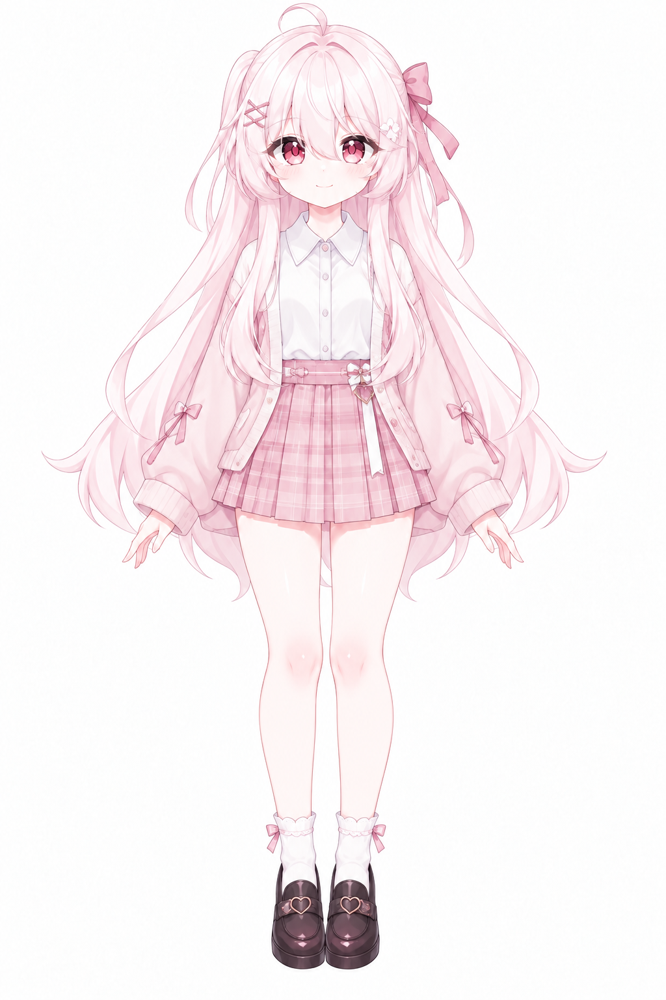
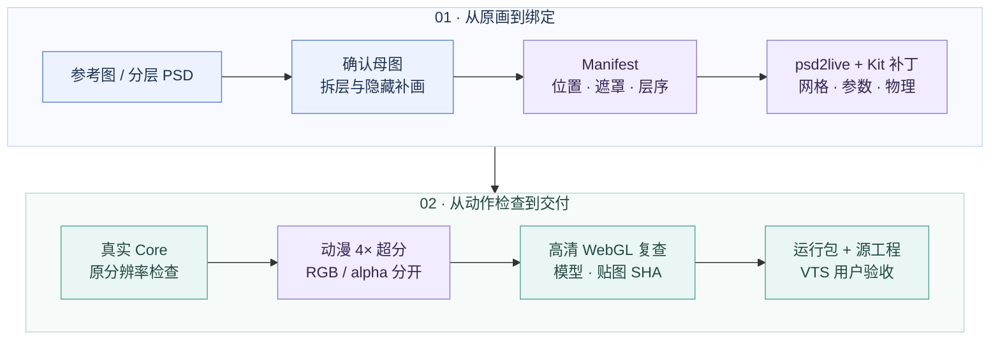

<div align="center">

# Live2D Agent Kit

[简体中文](README.md) · [English](README.en.md)


[](docs/workflow.md)
[](docs/case-study.md)
[](THIRD_PARTY_NOTICES.md)
[](examples/pink-sakura/LICENSE.md)
[](docs/verification.md)

[快速开始](#快速开始) · [角色示例](examples/pink-sakura/README.md) · [工具参考库](tools/README.md) · [完整流程](docs/workflow.md) · [排错经验](docs/troubleshooting.md) · [Agent Skill](SKILL.md)

<sub>This project is not affiliated with Live2D Inc.</sub>

</div>

---

Live2D Agent Kit 帮助 Codex 和其他 coding agent 把参考图或分层 PSD 制作为可运行的 `.moc3` 模型。
仓库包含拆层配方、psd2live 适配器、超分与检查脚本，也保留了嘴周色差、闭眼接缝和断发的修复记录。

本项目的角色制作与迭代使用了 **GPT-6 Astra Ultra**。其他 agent 可以按相同流程工作，
所需工具和检查步骤都有独立入口。单张立绘看不到的眼皮、口腔、后发和衣服仍需补画，
制作时以用户认可的脸部和画风为准。

> **第一次使用：** 先跑通原创几何最小示例，确认本机导出链与 Core 可用，再开始角色美术。
> 工具参考库记录实际使用、辅助检查与仅评估项目，获取说明和许可随条目提供。

## 能做什么

| 从哪里开始 | Kit 提供什么 | 你会得到什么 |
| --- | --- | --- |
| **参考图 / 正面立绘** | 母图确认、隐藏补画、五坐标系与精确遮罩工作法 | 可复建的素材与 manifest |
| **分层 PSD / PNG 图层** | 提取适配器、固定版 psd2live 与累计补丁 | PSD、CMO3、MOC3、图集、参数和物理 |
| **已有模型有接缝** | 嘴周色差、闭眼断线、黑边、发丝/背带错位的排查方法 | 定位到素材、绑定或采样的修复记录 |
| **结构正确但纹理模糊** | 本地 NCNN 动漫 4× 超分、独立 alpha、来源 SHA 检查 | 保持几何与 UV 的高清运行图集 |
| **需要面捕预览** | 真实 WebGL 模型、合成输入、可选的本地摄像头面部与肩部识别 | 可手调、校准、暂停和检查资源身份的预览网页 |
| **准备交付** | 资源验证、原生 Core 检查、浏览器实测与打包脚本 | 自足运行包、证据与明确的验收范围 |

## 角色示例与来源保护

**[Pink Sakura →](examples/pink-sakura/README.md)** 已收录可运行模型、五张基础源素材、三张可重建的眉毛素材、角色拆层配方与验证证据。
下面的演示从实际高清模型的 WebGL 画布录制，使用合成面捕输入；没有读取摄像头。

| 原始参考图 | 绑定后的全身 | 合成输入演示 |
| :---: | :---: | :---: |
|  |  |  |
| 用户提供的母图 | 高清模型的 WebGL 画布 | 72 帧，12 fps，合成输入 |

| 睁眼 | 闭眼 | 微笑张嘴 |
| :---: | :---: | :---: |
|  |  |  |
| 保留母图五官与画风 | 检查眼角和睫毛交接 | 检查嘴形与张嘴联动的肤色接缝 |

[模型文件](examples/pink-sakura/runtime/) · [重建步骤](examples/pink-sakura/README.md#复现模板) · [验证记录](examples/pink-sakura/verification/README.md)

[面捕与复现证据索引 →](docs/verification/README.md)：真实摄像头检查、冷源码编译和已提交源包重建分别记录，不需要从完整制作日志中寻找结果。

| 模型结构 | 动漫超分 | 实际验证 |
| --- | --- | --- |
| **24 个源层 · 26 个 Drawable · 24 个参数** | **2048² → 8192²**，AnimeVideo v3 4× | **202** 个原生姿态 · **22** 项 Web 检查 |
| 独立左右眉、眼睛、嘴形、头身、呼吸与 8 个头发参数 | 独立 alpha，低清/高清 MOC 逐字节一致 | **66** 个姿态、**91** 张画布截图，另录制 72 帧演示 |

完整证据见 [示例验证目录](examples/pink-sakura/verification/)；VTube Studio 仍由用户验收。
已复核 44 张脸部原像素裁切和 31 张全身概览，精度与抽样范围见报告；放大后仍有闭唇线偏淡、闭眼睫毛末端稍钝的小瑕疵，`EyeOpen` 0～0.25 保持闭眼姿态。
这是保守角度的 2D 绑定示例，身体使用整体图层，没有独立手臂/手指追踪。
CMO3 保留模型与绑定，但其可编辑图层从图集重建，不保留原 PSD 源图编辑链；重建时使用一并公开的源图和配方。
原始参考图按用户说明标注“此图片来自 ChatGPT Image2.5 生成”，隐藏补画和模型制作分别记录来源。

该示例素材采用 **[CC BY 4.0](examples/pink-sakura/LICENSE.md)**，允许署名使用和修改，禁止冒认原作者；
配方代码仍沿用 MIT。公开的模型资源可以被复制，因此采用署名文件、来源记录和可选水印帮助追溯，
不宣称能阻止提取。可见/隐水印的边界与验证方法见 [模型保护方案](docs/model-protection.md)。

## 一条完整的制作路线




先修正拆层和遮罩，再做超分。混入发片的衣服像素会跟着头发移动，提高分辨率只会让断口更明显。
完整步骤、每阶段交付和恢复方式见 [workflow.md](docs/workflow.md)。

## 快速开始

需要 **Git、Python 3.10+、JDK 21**；角色配方和浏览器检查还需要 **Node.js 22+**。先按 [setup.md](docs/setup.md) 配好 Java。
所有命令从仓库根目录运行，生成物放在忽略的 `work/`，每次实验使用新输出目录。

### 1 · 跑通真实导出

```sh
bash scripts/doctor.sh
bash scripts/setup-psd2live.sh
java --source 21 examples/minimal-model/GenerateExample.java work/minimal/assets
bash scripts/export-model.sh work/minimal/assets/manifest.json work/minimal/low
bash scripts/validate.sh --model work/minimal/low/Minimal.model3.json
```

这里生成 **16 个原创几何图层**，导出真正的 PSD、CMO3、MOC3 和 1024² 图集。
最后一行检查文件结构；原生检查另外配置官方 Core。

### 2 · 交给 agent 制作自己的角色

把自己的图片或 PSD 与下面的提示一起交给 agent：

```text
阅读 SKILL.md、tools/README.md 和 docs/workflow.md，按本仓库流程制作我的 Live2D 模型。
先检查可用工具并跑通最小示例，再确定母图、测量位置、拆层和绑定。
保留我认可的脸和画风；先修素材及接缝，再做专用动漫超分。
交付可复建的源工程、自足运行包、真实模型网页预览和对应文件的验证结果。
分别说明 Core、网页和 VTube Studio 已完成的验收范围。
```

更完整的长任务提示：[prompts/astra.md](prompts/astra.md)。
根目录 [SKILL.md](SKILL.md) 可以直接阅读，也可按宿主的技能安装方式随本仓库一起使用。

<details>
<summary><strong>3 · 官方 Core 验证与运行包打包</strong></summary>

从用户已有的合法安装或官方分发取得适合本机的 Java/native Core，见 [Core 配置](docs/setup.md#配置本机官方-core)。

```sh
export CUBISM_CORE_DIR=/path/to/your/local/core
bash scripts/validate_core.sh work/minimal/low/Minimal.moc3 work/minimal/core-report.json
bash scripts/validate.sh --model work/minimal/low/Minimal.model3.json \
  --core-report work/minimal/core-report.json
python3 scripts/package-model.py --model work/minimal/low/Minimal.model3.json \
  --core-report work/minimal/core-report.json --output work/minimal/runtime
```

打包结果为独立的运行文件夹与 ZIP，资源引用不依赖作者电脑的路径。
原生报告绑定实际 MOC 的 SHA；最终视觉与目标软件验收另行记录。

</details>

<details>
<summary><strong>4 · 专用动漫超分与真实网页预览</strong></summary>

超分使用本机 Upscayl CLI 与模型目录，具体获取和参数见 [upscaling.md](docs/upscaling.md)。

```sh
bash scripts/upscale-atlas.sh \
  --manifest work/minimal/assets/manifest.json \
  --export work/minimal/low --output work/minimal/upscale \
  --binary /path/to/upscayl-bin --models /path/to/models \
  --model realesr-animevideov3-x4
bash scripts/export-model.sh work/minimal/upscale/manifest-hd.json work/minimal/hd
```

最小示例的 1024² 图集变为 4096²，逻辑坐标不变。后续用本地 Web Core 与预览依赖准备页面：

```sh
python3 scripts/prepare-preview.py \
  --model work/minimal/hd/Minimal.model3.json --output work/minimal/preview \
  --cubism-core /path/to/live2dcubismcore.min.js --vendor-dir /path/to/vendor
python3 work/minimal/preview/server.py --port 8793
```

端口被占用时改用空闲端口。网页提供合成输入与可选的本地摄像头面部/上半身追踪；独立手臂和手指绑定不在当前实现范围。
依赖文件名、取景、输入映射与浏览器检查见 [网页模板说明](templates/web-preview/README.md)。

</details>

## 用摄像头驱动面部和上半身

网页提供单独的摄像头入口：眉毛、眨眼、视线、张嘴、微笑、头部角度，以及单摄像头估计的躯干/肩部姿态。模型需要对应可见绑定；切换模拟和手调参数会关闭摄像头。

```sh
python3 scripts/setup-tracking.py --directory .cache/mediapipe
python3 scripts/prepare-preview.py \
  --model examples/pink-sakura/runtime/PinkSakura.model3.json \
  --output work/pink-camera-preview \
  --cubism-core /path/to/live2dcubismcore.min.js --vendor-dir /path/to/vendor \
  --config examples/pink-sakura/preview-config.json \
  --tracking-dir .cache/mediapipe
python3 work/pink-camera-preview/server.py --port 8860
```

点击“开始面捕”，允许浏览器使用摄像头，正视镜头后校准。推理在浏览器本地执行，不上传或录制画面，也不请求麦克风。识别依赖按固定 URL 与 SHA 获取，不随仓库分发。预览服务的同源连接策略会拦截 SDK 默认的统计请求；换用其它服务时也须保留该策略。上半身姿态属于近似估计，没有手臂/手指绑定。使用方法和实际测试范围见 [摄像头指引](docs/camera-tracking.md)，变更见 [更新日志](CHANGELOG.md)。本次最终模型的 [16 项真实摄像头检查](docs/verification/camera-tracking.json)已通过；上半身实测覆盖双肩，未验证髋部俯仰精度。

## 没有 `work/`，还能复现吗？

`work/` 保存导出结果、临时图层、完整动作截图和日志。Pink Sakura 的基础源图、眉毛分解脚本与派生素材、测量坐标、补画配方以及运行模型都已提交；复现从 `examples/` 开始，不需要作者原来的工作目录。

| 文件或目录 | 是否随仓库提供 | 新环境如何取得 |
| --- | --- | --- |
| `examples/pink-sakura/source/` 与角色配方 | 提供 | 直接重建 manifest；所有引用源图在仓库内 |
| `examples/pink-sakura/runtime/` | 提供 | 用整份目录加载模型，保留相对路径 |
| `integrations/`、`patches/`、`scripts/` | 提供 | 用固定引擎提交和累计补丁重建 |
| `work/` | 不提供 | 执行示例步骤生成；输出目录必须为空 |
| `.cache/psd2live` 与 Gradle 缓存 | 不提供 | 安装脚本获取固定源码，Gradle 下载构建依赖 |
| 官方 Core、Web vendor、Upscayl 与权重 | 不提供 | 按各自获取说明准备，再通过参数指定路径 |
| 过去的私有角色 | 不提供，也不参与本示例 | 使用仓库示例或自己的授权素材 |

新示例为 24 层 Pink Sakura 配方和 16 层几何素材。完整空缓存引擎已重新编译，最小模型通过 Native Core 与 22 项真实网页检查；公开 Pink 配方也独立导出并通过 Core，MOC 与高清版一致。获取时使用源码精简 checkout 与可选的本地 curl 下载转发，并记录了下载重试。[复现审查](docs/reproducibility.md)列出执行范围、外部依赖和源包自检命令；[本次仓库审查](docs/repository-review.md)记录文档检查和脚本修复。

提交 **`7f391f4`** 的独立 `git archive` 检查也已通过：**59 项 Python、28 项 Node 测试**，三张眉毛衍生图与发布素材逐字节一致，24 层 Pink 与 16 层 Minimal 配方均可重建。[源包原报告](docs/verification/source-package-7f391f4.json)不执行引擎编译或 Core；[冷源码编译记录](docs/verification/cold-build/README.md)来自较早源包加明确记录的公开修改，两次验证的提交与执行范围分别保留。

## 本例用了哪一个超分模型？

实际使用的是 **`realesr-animevideov3-x4`**，通过 Upscayl 的 NCNN CLI 运行。没有采用 AnimeSharp 作为最终模型。

| 设置 | Pink Sakura 的实际记录 |
| --- | --- |
| 权重文件 | 同名的 `realesr-animevideov3-x4.param` 与 `.bin` |
| 推理配置 | 4×，tile 256，`-j 1:1:1`，同一 GPU 顺序处理 |
| 图集 | 一页 2048² RGBA → 一页 8192² RGBA |
| 透明边缘 | RGB 先延伸边缘颜色再神经超分；原 alpha 独立 bicubic 缩放 |
| 几何 | 逻辑画布、归一化 UV 不变；低分与高清 MOC 逐字节一致 |
| 来源与指纹 | [Upscayl custom-models](https://github.com/upscayl/custom-models#digital-art)、[获取及 SHA-256](docs/upscaling.md)、[实际推理记录](examples/pink-sakura/verification/upscale.json) |

图集超分不会修复错误拆层，也不会把源 PSD 的所有图层改成 4× 可编辑画稿。先处理发丝与衣服的遮罩、嘴周肤色，再提高运行纹理的分辨率。

## 工具参考库

**[查看完整工具目录 →](tools/README.md)** · [机器可读清单](tools/catalog.json) · [命令速查](tools/commands.md) · [宿主能力映射](tools/host-capabilities.md)

参考库现有 **47 项**，分为生产使用、辅助验证、仅评估与 kit 开发。
每项记录用途、使用证据、已知版本、上游来源、获取方式和许可边界。
仓库保留我们编写的适配器、补丁和脚本；第三方应用、权重和 SDK 通过原始来源获取。

| 类别 | 主要工具与原始来源 | 对应指引 |
| --- | --- | --- |
| **制作引擎** | [psd2live](https://github.com/tsunehimatoi/psd2live) · [Agent 架构](https://github.com/tsunehimatoi/psd2live/blob/master/docs/zh/AGENT_ARCHITECTURE.md) | [安装](docs/setup.md)、[适配器](integrations/psd2live/README.md)、[补丁](patches/README.md) |
| **官方基准** | [Live2D Simple Model](https://www.live2d.com/en/learn/sample/simple-model/) · [Cubism SDK](https://www.live2d.com/en/sdk/download/) · [Web SDK](https://www.live2d.com/en/sdk/download/web/) | [环境隔离检查](docs/tooling.md#先用官方简单模型隔离环境问题)、[Core 配置](docs/setup.md#配置本机官方-core) |
| **动漫超分** | [Upscayl](https://github.com/upscayl/upscayl) · [custom-models](https://github.com/upscayl/custom-models) · [upscayl-ncnn](https://github.com/upscayl/upscayl-ncnn) · [Real-ESRGAN](https://github.com/xinntao/Real-ESRGAN) | [AnimeVideo / AnimeSharp 比较与获取](docs/upscaling.md) |
| **网页运行与检查** | [PixiJS](https://github.com/pixijs/pixijs) · [pixi-live2d-display](https://github.com/guansss/pixi-live2d-display) · [Playwright](https://github.com/microsoft/playwright) | [真实模型预览](templates/web-preview/README.md)、[实测记录](docs/verification.md) |
| **摄像头识别** | [MediaPipe Tasks Vision](https://github.com/google-ai-edge/mediapipe) · Face / Pose Landmarker | [安装、校准与实际测试](docs/camera-tracking.md)、[固定依赖](tools/tracking-dependencies.json) |
| **Skill / MCP** | [本 kit Skill](SKILL.md) · [CLI-Anything Live2D](https://github.com/HKUDS/CLI-Anything/blob/main/live2d/agent-harness/cli_anything/live2d/skills/SKILL.md) · [CubismExternalEditMCP](https://github.com/nana7chi/CubismExternalEditMCP) | [MCP 能力与限制](mcp/README.md)、[宿主工具映射](tools/host-capabilities.md) |
| **构建与图像诊断** | Java / Gradle / Kotlin、Python / Pillow / NumPy / psd-tools / ImageMagick、FFmpeg、Node.js、Git、SHA-256、ZIP | [完整目录与来源](tools/README.md)、[按任务查命令](tools/commands.md) |

官方样例可用于检查加载环境。CLI 的资源检查、SDK 的网格求值、真实画面与 VTS 验收，各自记录实际完成范围。

## 实测到哪一步

下面是 **2026-09-12 的通用最小示例本地记录**，不是在线 CI 或所有角色的质量保证。
原角色的制作经过另见 [案例复盘](docs/case-study.md)。

| 导出与原生 | 高清纹理 | 浏览器 |
| --- | --- | --- |
| **16 层 → 真实 MOC3 / CMO3** | **1024² → 4096²** | **22 项真实 Web 检查通过** |
| 官方 Native Core 6.0.257 | NCNN 神经 RGB 4× + 独立 alpha | Web Core 5.1.0，实际 WebGL 绘制 |
| 192 个取样姿态，含 125 组嘴型/头身眼组合 | 低分与高清 **MOC 逐字节一致** | 浏览器载入的 MOC / PNG SHA 与清单一致 |

完整 [验证记录](docs/verification.md) 包含指纹、负例和范围。
新版最小示例包含独立左右眉素材，19 个参数均测得可见绑定；两个空眉毛槽位的旧记录保留为历史结果。

## 经验已经整理在这里

| 你正在做什么 | 从这里阅读 |
| --- | --- |
| 装工具、配置 Core、先验证环境 | [环境与安装](docs/setup.md) · [工具参考库](tools/README.md) |
| 开始一个新角色，或恢复长任务 | [完整工作流程](docs/workflow.md) · [Astra 长任务提示](prompts/astra.md) |
| 处理 PSD / PNG、裁切、层序与遮罩 | [Manifest 与五种坐标](docs/manifest.md) |
| 保留原脸，修闭眼、肤色接缝、背带和发丝 | [排错指南](docs/troubleshooting.md) · [案例复盘](docs/case-study.md) |
| 选择超分模型、保护透明边缘和 UV | [动漫超分](docs/upscaling.md) |
| 调参数、模拟输入、看动作和资源身份 | [网页预览](templates/web-preview/README.md) |
| 核对 MCP 是否适用、宿主缺少什么能力 | [MCP 指引](mcp/README.md) · [宿主能力映射](tools/host-capabilities.md) |
| 复建、验证和打包 | [命令速查](tools/commands.md) · [实际验证范围](docs/verification.md) |

<details>
<summary><strong>仓库结构</strong></summary>

```text
live2d-agent-kit/
├── README.md / README.en.md  中英文入口
├── SKILL.md                  Agent 工作规范
├── assets/readme/            头图及独立素材许可
├── LICENSE                  原创代码与文档的 MIT 许可
├── THIRD_PARTY_NOTICES.md    第三方范围与归属
├── tools/                   完整工具目录、JSON 清单、宿主映射、命令速查
├── docs/                    安装、流程、拆层、超分、排错、案例、验证
├── prompts/                 可直接交给 agent 的长任务提示
├── mcp/                     可选 MCP / skill 的接入说明
├── integrations/psd2live/    Manifest / PSD 适配器与引擎锁定信息
├── patches/                 经验证的 psd2live 累计补丁
├── scripts/                 导出、超分、Core 检查、预览与打包
├── templates/web-preview/   通用真实模型网页模板
├── examples/minimal-model/  原创几何测试素材生成器
├── examples/pink-sakura/    粉色角色源图、配方、高清模型与证据；素材 CC BY 4.0
├── tests/                   无 SDK 的自动检查
└── third_party/             补丁与适配器适用的 GPL 许可文本
```

</details>

## 许可与归属

原创独立代码、文档和提示采用 [MIT](LICENSE)。
`patches/psd2live-agent-kit.patch` 与 `integrations/psd2live/*.kt` 采用 **GPL-3.0-only**；
完整范围见 [THIRD_PARTY_NOTICES.md](THIRD_PARTY_NOTICES.md)。
用户绘画、官方样例、Live2D SDK/Framework、第三方应用和超分权重各自适用原条款。
Pink Sakura 图片与模型采用 [CC BY 4.0](examples/pink-sakura/LICENSE.md)。
README [头图](assets/readme/README.md)也单独采用 CC BY 4.0；头图由内置 Imagegen 生成，正文模型截图来自实际 WebGL 画布。

工具与上游来源见 [工具参考库](tools/README.md)。中文和英文说明分别参考 Humanizer-zh 与 Humanizer 做文字审校，保留技术细节、命令和验证范围。

**This project is not affiliated with Live2D Inc.**
