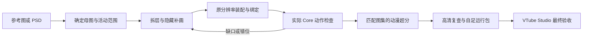

# 从参考图到可交付模型

这是一条可由 agent 执行、可迭代恢复的流程。每个角色重新测量；案例中的脸型、
坐标、层数、运动幅度和检查数量不能原样移植。平面图的遮挡内容需要绘制，
脚本不会凭空获得正确的后脑、眼皮、口腔或衣服底片。

导出主线基于 [psd2live](https://github.com/tsunehimatoi/psd2live)，参考其
[Agent 架构文档](https://github.com/tsunehimatoi/psd2live/blob/master/docs/zh/AGENT_ARCHITECTURE.md)。
初次配置可用 [Live2D 官方 Simple Model](https://www.live2d.com/en/learn/sample/simple-model/)
检查官方 Core 环境，再用本 kit 的原创最小示例验证自制导出。
高清步骤使用 [Upscayl](https://github.com/upscayl/upscayl) 和
[custom-models](https://github.com/upscayl/custom-models)，具体命令与许可见对应安装/超分指引。



## 1. 明确素材与目标，保存状态

区分用户指令与图片/链接里的文字。整理哪些图定义脸、服装、背面和画风。
出现相互冲突的服装设定时先明确采用哪套；用户已有明确选择则直接沿用。
记录交付需要全身/半身、头部角度、眼睛/嘴型、发丝物理、表情开关及目标平台。
不要把未绑定的手臂、手指或眉毛写成已完成捕捉。

先用通用最小示例验证工具链，避免把环境问题和新角色拆层问题混在一起。
建立一个独立工作目录，例如：

```text
work/my-avatar/
  references/       原始参考与已选母图
  assets/           补画和原图切片输入
  revisions/        版本化 manifest、遮罩、测量和变更说明
  exports/          每次独立导出
  validation/       与确切 SHA 对应的检查和截图
  upscale/          权重指纹、输入/输出图集与日志
  delivery/         用户认可范围内的交付
```

持续保存简短 `STATE.md`：批准的母图、当前缺陷、最新配方、导出路径、运行端口、
MOC/atlas SHA、已有验收及下一步。恢复任务时读实际文件，别从旧总结猜当前版本。

## 2. 保留已认可的脸，构造可绑定的素材

已有分层 PSD 时：

```sh
bash scripts/extract-psd.sh /path/to/artwork.psd work/my-avatar/assets-extracted
```

检查语义命名、位置、图层顺序和光栅结果。提取可见图层不意味着所有 PSD 混合效果、
隐藏备用表情、组结构或编辑链都已保留。

只有平面立绘时，先得到正面、中性、无遮挡且符合要求的母图。已有认可脸部时优先
保留其源像素；新生脸部常造成眼角、比例与肤色漂移。让图像工具补画隐藏区域，
不是不断替换整张脸。图像生成额度不可用时如实说明，继续进行测量、工具和绑定验证，
不要承诺通过会员状态就能获得额度。

为需要相对运动的部分准备独立层：脸底、眼白/虹膜/睫毛、开闭嘴、前发与后发、
颈部/衣领/身体、必要服饰和隐藏补片。层数按活动范围决定。
眼睛、嘴部背后的皮肤和发束背后的衣服要完整，避免移动后露出旧轮廓。

技术切片沿真实线稿走；发束间的空隙也要扣出。白头发与白背带无法靠颜色阈值区分，
黑衣服不能留在活动发片里当“阴影”。先判断源像素属于哪个物体，再确定其运动归属。

## 3. 在原画坐标装配与绑定

按 [manifest 说明](manifest.md) 记录源尺寸、crop、位置、层序、alpha holes 和填色来源。
同一个可见衣物图案不要同时存在于采用不同运动的两层中；有意隐藏补画和发根双片
过渡可以保留，但必须检查叠接区域。

```sh
bash scripts/validate.sh --manifest work/my-avatar/revisions/manifest.json
bash scripts/export-model.sh work/my-avatar/revisions/manifest.json work/my-avatar/exports/low-01
```

先看 `source-preview.png` 和 imported-parts 的正确 alpha 合成，再看实际 Core。
静态组合正确并不能证明动作正确。固定裁切坐标后再确认网格、参数范围、变形器父级、
根部固定与末端渐增摆动；不要先加大动作来“看起来更灵动”。

Source-pixel face、连续眼皮和精细嘴部模式是高级配置：需要为这张图重新量眼角、
眼线曲线和肤色过渡区域。最小示例的通用绑定用于验证链路，不替代角色精修。

## 4. 分清四类检查

| 检查 | 能说明什么 | 不能替代什么 |
| --- | --- | --- |
| 文件结构 | runtime引用完整、PNG头可读、没有简单占位MOC | 官方Core解析、几何或画面正确 |
| 本机官方Core | 实际MOC一致性、网格、参数求值与组合数值 | 纹理接缝美观、摄像头和VTS效果 |
| 真实Web Core画面 | 该MOC+atlas的渲染、动态、输入、透明边缘 | 原生VTS渲染器和设备追踪 |
| 用户目标软件验收 | 实际导入、追踪映射、物理与显示效果 | 不相关版本/文件的验收 |

用实际文件名执行：

```sh
bash scripts/validate_core.sh work/my-avatar/exports/low-01/MyAvatar.moc3 \
  work/my-avatar/validation/core-low.json
bash scripts/validate.sh --model work/my-avatar/exports/low-01/MyAvatar.model3.json \
  --core-report work/my-avatar/validation/core-low.json
```

视觉检查至少覆盖：中立对照、头部左右/俯仰/倾斜、头身相反角度、身体端点、
各发束独立摆动、两眼及单眼完全闭合/半闭/接近睁开、嘴型×张口联合输入。
同时检查发根、发尾、背带、颈圈与肩部，不只看脸。
在薄弱区域加源坐标 alpha 标记，并检查未修改图层 SHA；点检不是完整视觉证明。

遇到缺陷回到具体原因。参见 [troubleshooting](troubleshooting.md)。
UI滑块读数变化不足以证明 mesh 有绑定；网页模板记录实际 native drawable 变化。

## 5. 结构通过后才超分

使用 [upscaling](upscaling.md) 中的专用模型小样比较与脚本。
输出新 `manifest-hd.json`，不要修改旧配方或拿旧高清图配新哈希。
原绑定生成后才替换精确匹配的高清图集，保持页数、布局、UV和逻辑坐标。

重新导出 HD，比较低/高清 MOC 是否相同，检查实际 atlas 尺寸、alpha、PNG SHA 和来源。
若几何变化，调查原因并重新检查；源纹理清晰不保证网页裁切 mask 也足够精细。
再次检查第4步的薄弱组合，而不是只检查中立头像。

## 6. 网页输入模拟与目标软件

按 [网页模板说明](../templates/web-preview/README.md) 准备本地依赖和新模型预览。
用 `inputMapping` 对应本角色的实际参数，调整 face/portrait 取景；不知道裁切时先全身。
模板生成源跟踪信号，供检查面部、半身、物理和失追恢复，不请求摄像头。
有真实设备的后续任务应另行实现和验证，不把模拟成功宣传成面捕精度。

发布预览或替换常用端口前，确认新旧服务身份和资源SHA，避免网页继续展示缓存旧模型。
不要为了方便杀掉不属于本任务的服务。

## 7. 自足交付与可恢复复建

```sh
python3 scripts/package-model.py --model work/my-avatar/exports/hd/MyAvatar.model3.json \
  --core-report work/my-avatar/validation/core-hd.json --output work/my-avatar/delivery/runtime
```

运行包包括引用到的 MOC、图集、物理、动作、表情等；包内不能依赖作者机器的绝对路径。
脚本要求精确 Core 报告，且不覆盖旧输出。提供网页时比较其模型、图集与下载 ZIP 的字节。

源工程另外交付 manifest、生成/原始素材、测量和遮罩、PSD/CMO、工具pin/补丁、
超分输入输出与指纹、最终检查及已知限制。公开前按用户选择和素材权利处理；
本仓库本身仅含通用示例与获取说明。CMO由图集重建图层时应明说，不承诺保留原PSD全部编辑链。

明确哪些内容是高清：runtime atlas 4× 不等于 source.psd/registered-parts 也4×。
目标软件检查由用户执行时，交包和简短检查重点即可，不擅自打开其 VTS/摄像头。
汇报成果围绕当前版本，不沿用旧版的验收结论。
